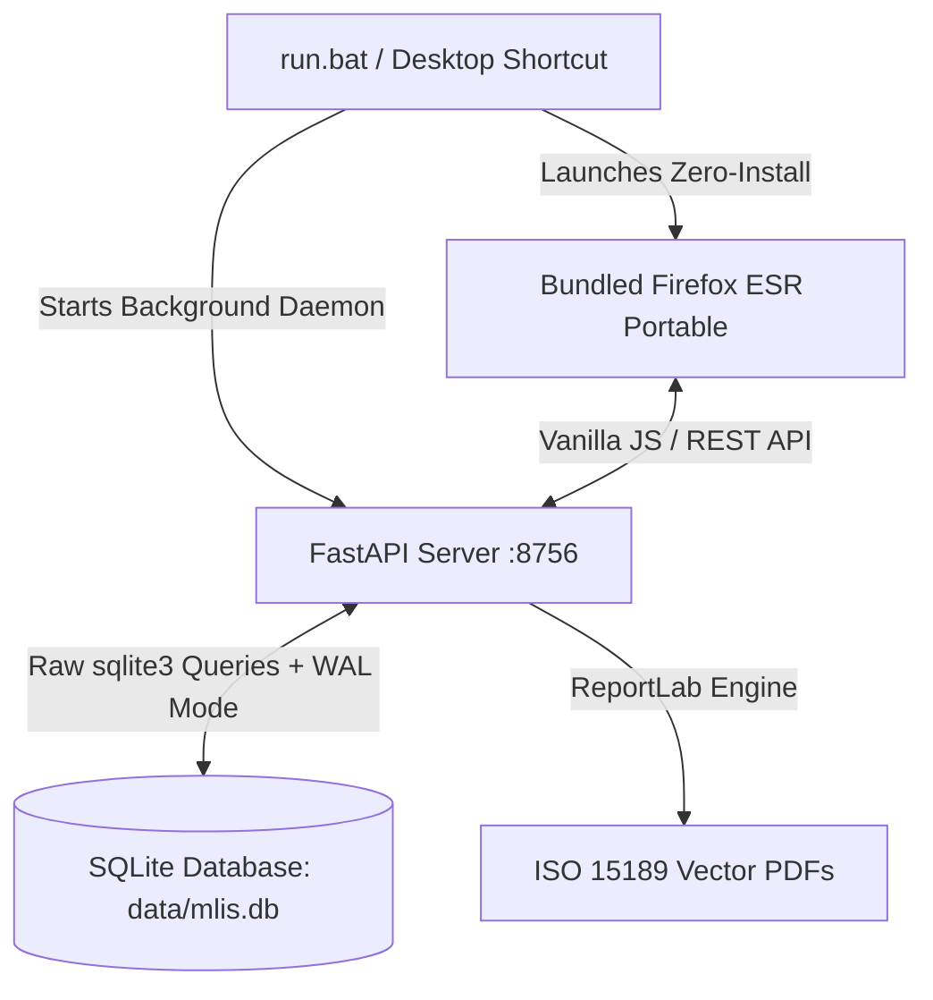

<div align="center">


<br />

# M-LIS
**Laboratory Information System**

**A high-performance, air-gapped desktop laboratory information system engineered for extreme low-spec hardware.**

[]()
[]()
[](LICENSE)
[]()
[]()
[]()

[Overview](#overview) • [The Excel Problem](#the-legacy-excel-problem) • [Features](#features) • [Architecture](#architecture--tech-stack) • [Air-Gapped Deployment](#air-gapped-offline-deployment--packaging) • [Customization](#portability--branding)

</div>

---

## Overview

**M-LIS** is an offline-first laboratory management system built to digitize diagnostic reporting and client test workflows. Designed to comply with standard **HMIS 105 Section 6 Laboratory Surveillance** guidelines, it completely replaces fragile legacy Excel macros with a robust, relational database-backed application.

It is specifically engineered to run flawlessly on legacy hospital workstations (Core 2 Duo / 2GB RAM) without requiring an internet connection, complex installations, or heavy browser frameworks.

---

## The Legacy Excel Problem

This system was built to directly solve the structural vulnerabilities of the previous macro-heavy `.xlsb` reporting system:

| The Legacy Excel Problem | The AMH Tracker Solution |
| :--- | :--- |
| **Silent Data Loss:** Full delete-and-reinsert macros wiped historical data if a test name was changed. | **Relational Integrity:** Raw SQLite ensures permanent, structured data retention and safe migrations. |
| **Formula Corruption:** Technicians accidentally overwrote `SUMIFS` cells with static numbers, freezing reports. | **Immutable Logic:** Calculations happen dynamically on the FastAPI backend; the UI is strictly read-only for reports. |
| **Hardcoded Limits:** Trend calculations stopped at row 292; later entries were silently ignored. | **Infinite Scaling:** Dynamic database queries aggregate thousands of records in milliseconds. |
| **Zero Accountability:** No audit trail for who entered or altered data. | **Session Tracking:** Every entry, edit, and configuration change is stamped with the authenticated user ID and timestamp. |

---

## Features

- **Client Diagnostic Logging:** Track client demographics alongside detailed multi-parameter test results (e.g., CBC panels, WBC counts, biochemical assays, reference ranges).
- **Automated Analyzer Portal:** One-click clipboard ingestion for automated hematology analyzers (e.g. Nihon Kohden Celltac α MEK-6500K) with instant regex parsing and input population.
- **Clinical Flagging Engine:** Real-time calculation of reference range alerts (`[!] High`, `[!] Low`, `[!!] Critical`) based on national clinical standards.
- **Stock & Reagent Management:** Comprehensive inventory tracking for diagnostic kits (HIV, Malaria, etc.) with FIFO batch lot tracking, buffer alerts, and wastage logging.
- **ISO 15189 Vector PDF Engine:** Text-selectable, official diagnostic report slips generated directly in Python via ReportLab with dual-identifier security, letterhead branding, and verifier digital signatures.
- **Automated Surveillance Roll-up:** Client-level diagnostics automatically increment the master Uganda HMIS 105 Section 6 daily aggregate counts.
- **Dynamic Aggregation:** Real-time generation of Daily, Weekly, Monthly, and Financial Year (July–June) operations and surveillance reports.
- **Audit Ledger & RBAC:** Complete 3-tier Role-Based Access Control mapped to Uganda Ministry of Health (MoH) cadres with immutable before/after change logs.

---

## Architecture & Tech Stack

To meet the strict hardware constraints of legacy medical workstations (down to 1.0 GB RAM), the architecture aggressively avoids heavy abstractions (No React, No ORMs, No Electron).



### 1. Bundled Zero-Install Portable Browser
M-LIS packages **Firefox ESR Portable** directly within the release distribution. When the technician clicks the desktop shortcut or `run.bat`, the system launches the dedicated portable browser pointed to `http://127.0.0.1:8756/` with full modern CSS/JS rendering, native print dialogs, and low RAM footprint (~80MB), completely independent of whatever legacy browser is installed on the host OS.

### 2. Zero-Dependency Frontend
The UI is built purely with **Vanilla JavaScript** and **Standard CSS**. It uses lightweight event-driven routing, tab navigation, dynamic DOM updates, and custom SVG icons without node_modules, Webpack, or heavy framework overhead.

### 3. High-Performance Raw SQL Backend
The database layer bypasses heavy ORMs. It uses standard Python `dataclasses` and raw `sqlite3` queries with Write-Ahead Logging (WAL) for maximum speed and sub-50MB server memory usage.

---

## System Requirements & Minimum Target Machine Checklist

Engineered and field-verified for extreme resource-constrained clinical environments:

| Component | Minimum Specification (Verified) | Recommended / Target |
| :--- | :--- | :--- |
| **Processor (CPU)** | Intel Core 2 Duo / Pentium Dual-Core 1.8 GHz | Intel Core i3 / i5 or equivalent AMD |
| **Memory (RAM)** | **1.0 GB RAM** (Server < 50MB, Portable Browser ~80MB) | 2 GB – 4 GB+ RAM |
| **Storage (Disk)** | 500 MB free space (Python + Wheels + SQLite DB + Portable Browser) | 1 GB+ free space |
| **Operating System** | Windows 7 SP1 / Windows 10 (v1511+) / Windows 11 / Linux | Windows 10 / 11 (64-bit) |
| **Display Resolution**| 1024 x 768 pixels (optimized high-contrast UI) | 1280 x 800 or 1920 x 1080 |
| **Software Runtime** | Python 3.11+ (Check "Add Python to PATH" on install) | Python 3.11+ 64-bit |
| **Web Browser** | **Pre-bundled Firefox ESR Portable** (Zero installation required) | Pre-bundled Portable Edition |
| **Network** | **100% Air-Gapped / Offline** (No internet required) | Isolated Localhost `127.0.0.1:8756` |

---

## Air-Gapped Offline Deployment & Packaging

The application supports completely offline 1-click deployment via a self-contained ZIP archive or portable storage.

### 1. Build the Release Package (On internet-connected Development PC):
```cmd
:: Builds the standalone release archive (downloads wheels, stages assets, creates ZIP)
pack_usb.bat
```
*(Outputs `dist/mlis-release.zip` and staged folder at `dist/mlis/`)*

### 2. Install on Target Workstation (Air-Gapped Client PC):
1. Transfer `dist/mlis-release.zip` (or the unpacked folder) to the target PC.
2. Extract the archive (Right-click -> **Extract All...**).
3. Ensure Python 3.11+ is installed (with **"Add Python to PATH"** checked).
4. Double-click **`setup.bat`**:
   - Automatically installs pre-packaged dependency wheels offline from `offline_packages/wheels/`.
   - Initializes the local SQLite database (`data/mlis.db`) and seeds standard clinical catalog data.
   - Automatically creates the **M-LIS** shortcut on your Desktop.
5. Double-click **`run.bat`** (or the Desktop shortcut) to launch the system.

### 3. Incremental Updates & Maintenance:
To deploy bugfixes or new features to an existing target installation without full reinstallation:
- Simply copy the updated file(s) (e.g., `backend/app/parsers/nihon_kohden.py` or `frontend/static/js/app.js`) to the target installation directory.
- Restart the server via `run.bat`.
- The database in `data/mlis.db` is strictly preserved and never overwritten.

---

## Portability & Branding

The system features dynamic facility branding. Super Administrators can customize the facility name, acronym, letterhead, and contact details directly in the Admin Panel without touching code. Default facility settings can also be pre-configured in `assets/branding/theme.json`.

## Developer Guidelines

For developers contributing to this project, please strictly adhere to our foundational documents:
1. **[Product Requirements Document (PRD)](docs/PRD.md)**: Outlines the product vision, personas, and feature epics.
2. **[Software Requirements Specification (SRS)](docs/SRS.md)**: Details system architecture, database schema, and security protocols.
3. **[Functional Specification Document (FSD)](docs/FSD.md)**: Details screen layouts, data entry workflows, and operational edge cases.
4. **[Best Practices](docs/BEST_PRACTICES.md)**: Outlines UI/UX constraints and surgical coding standards.

---

## License

This project is open-source and licensed under the **MIT License**. It is freely available for adoption, modification, and distribution by other medical institutions seeking to modernize their offline data infrastructure.
