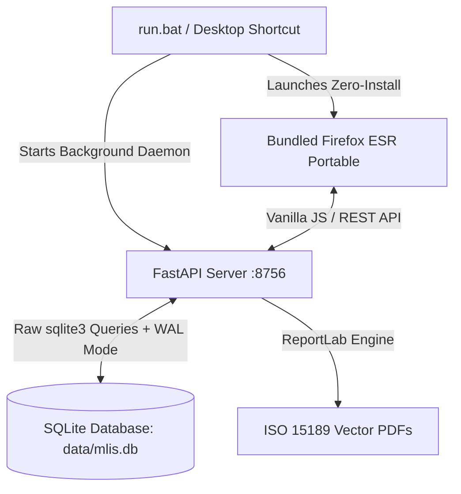

<div align="center">


<br />

# M-LIS
**Laboratory Information System**

**A high-performance, air-gapped desktop laboratory information system engineered for extreme low-spec hardware.**

[]()
[]()
[](LICENSE)
[]()
[]()
[]()

[Overview](#overview) • [Features](#features) • [Architecture](#architecture--tech-stack) • [Installation & Setup](#installation--developer-setup) • [Air-Gapped Deployment](#air-gapped-offline-deployment--packaging) • [Customization](#portability--branding)

</div>

---

## Overview

**M-LIS** is an offline-first laboratory information system engineered to digitize diagnostic workflows, reagent stock tracking, and clinical reporting. Designed in strict compliance with standard **Uganda HMIS 105 Section 6 Laboratory Surveillance** guidelines, it provides a robust relational database-backed application that eliminates manual registers and transcription errors.

It is specifically engineered to run smoothly on resource-constrained hospital workstations (down to Intel Core 2 Duo / 1.0 GB RAM) without requiring an internet connection or modern OS upgrades.

---

## Features

- **Client Diagnostic Logging:** Track client demographics alongside detailed multi-parameter test results (e.g., CBC panels, WBC counts, biochemical assays, reference ranges).
- **Automated Analyzer Portal:** One-click clipboard ingestion for automated hematology analyzers (e.g. Nihon Kohden Celltac α MEK-6500K) with instant regex parsing and input population.
- **Standard Clinical Flagging Engine:** Dynamic calculation of standard clinical indicators: Low (`L`), High (`H`), Critical Low (`L*`), Critical High (`H*`), Qualitative Abnormal (`⚠`), and automated evaluation of the Uganda MoH 3-test HIV algorithm.
- **Stock & Reagent Management:** Comprehensive inventory tracking for diagnostic kits (HIV, Malaria, etc.) with FIFO batch lot tracking, buffer alerts, and wastage logging.
- **ISO 15189 Vector PDF Engine:** Text-selectable, official diagnostic report slips generated directly in Python via ReportLab with dual-identifier security, letterhead branding, and verifier digital signatures.
- **Automated Surveillance Roll-up:** Client-level diagnostics automatically increment the master Uganda HMIS 105 Section 6 daily aggregate counts.
- **Historical & Backlog Data Entry:** Permanent, high-speed register capture module allowing rapid summary entry of physical lab books (Tests Done, Positive/Findings, In-House, Referral, Outreach, Self-Request) across any historical date range with seamless blending into Operations and Surveillance analytics.
- **Dynamic Aggregation:** Real-time generation of Daily, Weekly, Monthly, and Financial Year (July–June) operations and surveillance reports.
- **Audit Ledger & RBAC:** Complete 3-tier Role-Based Access Control mapped to Uganda Ministry of Health (MoH) cadres with immutable before/after change logs.

---

## Architecture & Tech Stack

To meet the strict hardware constraints of legacy medical workstations (down to 1.0 GB RAM), the architecture aggressively avoids heavy abstractions (No React, No ORMs, No Electron).



### 1. Bundled Zero-Install Portable Browser
M-LIS packages **Firefox ESR Portable** directly within the release distribution. When the technician clicks the desktop shortcut or `run.bat`, the system launches the dedicated portable browser pointed to `http://127.0.0.1:8756/` with full modern CSS/JS rendering, native print dialogs, and low RAM footprint (~80MB), completely independent of whatever legacy browser is installed on the host OS.

### 2. Zero-Dependency Frontend
The UI is built purely with **Vanilla JavaScript** and **Standard CSS**. It uses lightweight event-driven routing, tab navigation, dynamic DOM updates, and custom SVG icons without node_modules, Webpack, or heavy framework overhead.

### 3. High-Performance Raw SQL Backend
The database layer bypasses heavy ORMs. It uses standard Python `dataclasses` and raw `sqlite3` queries with Write-Ahead Logging (WAL) for maximum speed and sub-50MB server memory usage.

---

## System Requirements & Minimum Target Machine Checklist

Engineered and field-verified for extreme resource-constrained clinical environments:

| Component | Minimum Specification (Verified) | Recommended / Target |
| :--- | :--- | :--- |
| **Processor (CPU)** | Intel Core 2 Duo / Pentium Dual-Core 1.8 GHz | Intel Core i3 / i5 or equivalent AMD |
| **Memory (RAM)** | **1.0 GB RAM** (Server < 50MB, Portable Browser ~80MB) | 2 GB – 4 GB+ RAM |
| **Storage (Disk)** | 500 MB free space (Python + Wheels + SQLite DB + Portable Browser) | 1 GB+ free space |
| **Operating System** | Windows 7 SP1 / Windows 10 (v1511+) / Windows 11 / Linux | Windows 10 / 11 (64-bit) |
| **Display Resolution**| 1024 x 768 pixels (optimized high-contrast UI) | 1280 x 800 or 1920 x 1080 |
| **Software Runtime** | Python 3.11+ (Check "Add Python to PATH" on install) | Python 3.11+ 64-bit |
| **Web Browser** | **Pre-bundled Firefox ESR Portable** (Zero installation required) | Pre-bundled Portable Edition |
| **Network** | **100% Air-Gapped / Offline** (No internet required) | Isolated Localhost `127.0.0.1:8756` |

---

## Installation & Developer Setup

Because binary browser distributions and pre-downloaded wheels are excluded from Git to keep the repository lightweight, follow these steps when setting up the repository from scratch:

### 1. External Prerequisites & Downloads

| Resource | Required Version | Download Link | Notes |
| :--- | :--- | :--- | :--- |
| **Python** | 3.11 or higher | [python.org/downloads](https://www.python.org/downloads/) | **CRITICAL:** Check *"Add Python to PATH"* during install |
| **Firefox ESR Portable** | Latest ESR | [PortableApps.com Firefox ESR](https://portableapps.com/apps/internet/firefox-portable-esr) | Bundled zero-install browser for legacy PCs |
| **7-Zip** *(Optional)* | Any recent version | [7-zip.org](https://www.7-zip.org/) | Required to extract `.paf.exe` installers if doing manual staging |

### 2. Setting Up the Portable Browser

1. Download `FirefoxPortableESR_..._English.paf.exe` from [PortableApps.com](https://portableapps.com/apps/internet/firefox-portable-esr).
2. Extract the contents into `portable_browser/firefox/` in the project root:
   ```cmd
   :: Using 7-Zip (or run the installer and set destination to portable_browser\firefox)
   "C:\Program Files\7-Zip\7z.exe" x FirefoxPortableESR_*.paf.exe -o"portable_browser\firefox" -y
   ```
3. Verify that `portable_browser/firefox/FirefoxPortable.exe` (or `App/Firefox64/firefox.exe`) exists.

### 3. Installing Dependencies & Seeding Database

Open a terminal (Command Prompt / PowerShell) in the project directory:

```bash
# 1. Install Python packages
pip install -r requirements.txt

# 2. Run initial installation & database seed script
python install.py
```

`install.py` will:
* Initialize the SQLite schema in `data/mlis.db`.
* Seed 7 laboratory sections, 126 clinical tests, specimen types, and reference ranges.
* Create a customized **M-LIS** shortcut on your Desktop.

### 4. Launching the System

Double-click the **M-LIS** shortcut on your Desktop or run:

```cmd
run.bat
```

* The server starts on `http://127.0.0.1:8756/`.
* The bundled portable browser opens automatically to the login screen.
* **First-Time Setup:** Click **Register** on the initial screen to create your first account. The very first registered user is automatically designated as the **Super Administrator**.

---

## Air-Gapped Offline Deployment & Packaging

To create a self-contained, 100% offline distribution package for target hospital PCs:

### 1. Build the Release Package (On internet-connected Development PC):
```cmd
python pack_release.py
```
*(Automatically stages backend, frontend, assets, launcher, offline wheels, and the portable browser into `dist/mlis-release.zip`)*

### 2. Deploy on Target Workstation (Air-Gapped Client PC):
1. Copy `dist/mlis-release.zip` via USB drive to the target computer.
2. Extract the ZIP archive (Right-click -> **Extract All...**).
3. Ensure Python 3.11+ is installed on the target PC (with **"Add Python to PATH"** enabled).
4. Double-click **`setup.bat`**:
   - Automatically installs pre-packaged wheels from `offline_packages/wheels/` (zero internet required).
   - Initializes and seeds `data/mlis.db`.
   - Creates the Desktop shortcut.
5. Double-click the **M-LIS** Desktop shortcut (or `run.bat`) to launch.

---

## Portability & Facility Branding

The system features dynamic facility branding across the UI, desktop launcher, and PDF diagnostic reports.

- **Admin Customization:** Super Administrators can customize the facility name, acronym, letterhead, and contact details directly in the **Admin Panel -> Facility Settings** without touching code.
- **Report Letterhead Graphics:** M-LIS supports full-page A4 background graphics (single-page, first page header, middle watermark, and last page footer) for official PDF generation.
- **Detailed Setup Guide:** See **[assets/branding/README.md](assets/branding/README.md)** for complete specifications, graphic dimensions, file naming, and JSON preset configuration.

## Developer Guidelines

For developers contributing to this project, please strictly adhere to our foundational documents:
1. **[Product Requirements Document (PRD)](docs/PRD.md)**: Outlines the product vision, personas, and feature epics.
2. **[Software Requirements Specification (SRS)](docs/SRS.md)**: Details system architecture, database schema, and security protocols.
3. **[Functional Specification Document (FSD)](docs/FSD.md)**: Details screen layouts, data entry workflows, and operational edge cases.
4. **[Best Practices](docs/BEST_PRACTICES.md)**: Outlines UI/UX constraints and surgical coding standards.

---

## License

This project is open-source and licensed under the **MIT License**. It is freely available for adoption, modification, and distribution by other medical institutions seeking to modernize their offline data infrastructure.
