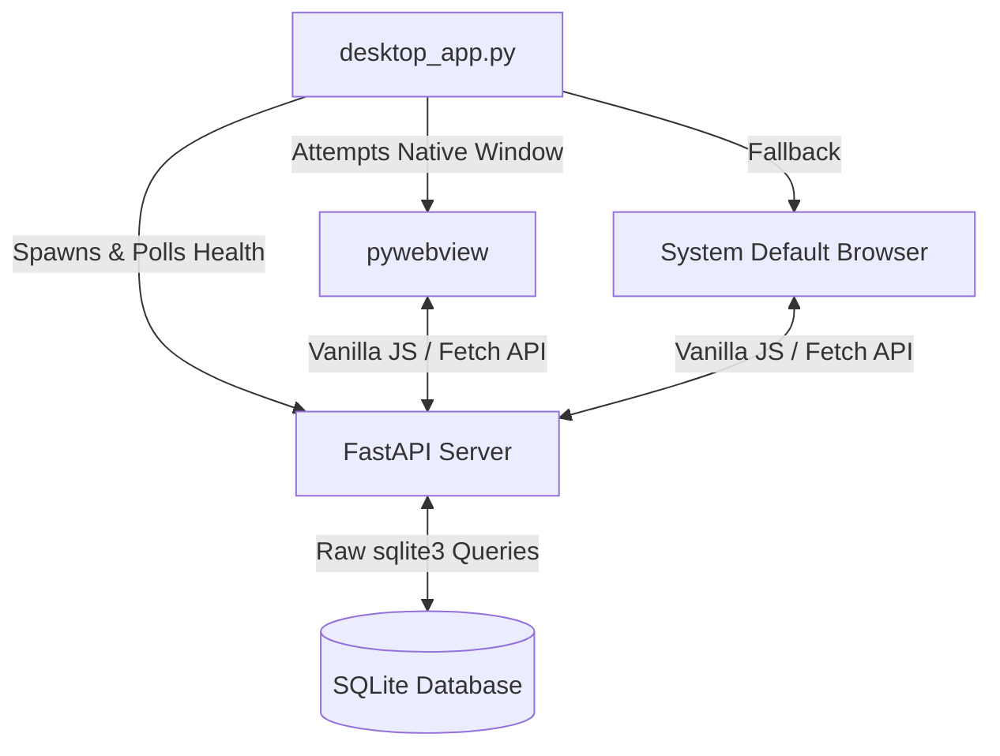

<div align="center">


<br />

# AMH Lab Tracker
**Ahmadiyya Muslim Hospital, Mbale, Uganda**

**A high-performance, air-gapped desktop laboratory information system engineered for extreme low-spec hardware.**

[]()
[]()
[](LICENSE)
[]()
[]()
[]()

[Overview](#overview) • [The Excel Problem](#the-legacy-excel-problem) • [Features](#features) • [Architecture](#architecture--tech-stack) • [Air-Gapped Deployment](#air-gapped-usb-deployment) • [Customization](#portability--branding)

</div>

---

## Overview

**AMH Lab Tracker** is an offline-first laboratory management system built to digitize diagnostic reporting and patient test workflows. Designed to comply with the Ugandan Ministry of Health **HMIS 105 Section 6 Laboratory Surveillance** guidelines, it completely replaces fragile legacy Excel macros with a robust, relational database-backed application.

It is specifically engineered to run flawlessly on legacy hospital workstations (Core 2 Duo / 2GB RAM) without requiring an internet connection, complex installations, or heavy browser frameworks.

---

## The Legacy Excel Problem

This system was built to directly solve the structural vulnerabilities of the previous macro-heavy `.xlsb` reporting system:

| The Legacy Excel Problem | The AMH Tracker Solution |
| :--- | :--- |
| **Silent Data Loss:** Full delete-and-reinsert macros wiped historical data if a test name was changed. | **Relational Integrity:** Raw SQLite ensures permanent, structured data retention and safe migrations. |
| **Formula Corruption:** Technicians accidentally overwrote `SUMIFS` cells with static numbers, freezing reports. | **Immutable Logic:** Calculations happen dynamically on the FastAPI backend; the UI is strictly read-only for reports. |
| **Hardcoded Limits:** Trend calculations stopped at row 292; later entries were silently ignored. | **Infinite Scaling:** Dynamic database queries aggregate thousands of records in milliseconds. |
| **Zero Accountability:** No audit trail for who entered or altered data. | **Session Tracking:** Every entry, edit, and configuration change is stamped with the authenticated user ID and timestamp. |

---

## Features

- **Patient Diagnostic Logging:** Track patient demographics alongside detailed multi-parameter test results (e.g., CBC panels, WBC counts, reference ranges).
- **Automated Surveillance Roll-up:** Patient-level diagnostics (like HIV Determine/STAT-PAK) automatically increment the master HMIS 105 daily aggregate counts.
- **Dynamic Aggregation:** Real-time generation of Daily, Weekly, Monthly, and Financial Year (July–June) performance reports and positivity rates.
- **Native Print Integration:** Custom `@media print` CSS strips out the UI for beautiful, official A4 paper slips and reports via `window.print()`.
- **Client-Side CSV Export:** One-click data exports generated locally via JS Blob objects for use in Microsoft Excel.
- **Robust Audit Trail:** Real-time "Paper Register Total" verification to catch mismatching tallies before data is committed to the database.

---

## Architecture & Tech Stack

To meet the strict hardware constraints of legacy medical workstations, the architecture aggressively avoids heavy abstractions (No React, No ORMs, No Electron).



### 1. Hybrid Desktop Shell

The launcher (`desktop_app.py`) spawns the Uvicorn server in a non-blocking subprocess and polls `127.0.0.1:8756/api/health`.

* **Primary:** Wraps the UI in a native OS window using `pywebview`.
* **Graceful Fallback:** If native graphics drivers fail on 15-year-old hardware, it catches the exception and launches the application in the system's default browser.

### 2. Zero-Dependency Frontend

The UI is built purely with **Vanilla JavaScript** and **Standard CSS**. It uses custom JS classes for client-side routing, tab navigation, DOM updates, and SVG template rendering. No build steps, no Node.js, and negligible RAM footprint.

### 3. Raw SQL Backend

The database layer bypasses heavy ORMs (like SQLAlchemy). It uses standard Python `dataclasses` and raw `sqlite3` queries for maximum speed and predictable memory usage on low-spec machines.

---

## System Requirements

Engineered for resource-constrained environments:

* **Processor:** Intel Core 2 Duo / Early Core i-series (or equivalent)
* **Memory:** 2GB RAM minimum
* **OS:** Windows 7 / Windows 10 / Lightweight Linux distributions
* **Network:** 100% Offline (No internet required)

---

## Air-Gapped USB Deployment

The primary deployment strategy is designed for completely offline installation via a USB flash drive.

**1. Prepare the Payload (On an internet-connected PC):**

```cmd
:: Downloads all FastAPI/Uvicorn dependencies as .whl files
pack_usb.bat

```

**2. Install on Target PC (Air-gapped):**
Transfer the project folder to the offline hospital computer and run the local installation:

```cmd
:: Installs Python packages from the local /wheels folder
pip install --no-index --find-links=usb_drive/wheels -r requirements.txt

:: Initializes DB, creates users, and places a shortcut on the Desktop
python3 install.py

```

---

## Portability & Branding

While currently branded for Ahmadiyya Muslim Hospital, the system is designed to be highly portable for any Ugandan regional hospital or health center.

Administrators can easily re-theme the entire application without touching code:

1. Replace `assets/branding/logo.png` with a new facility logo.
2. Edit `assets/branding/theme.json` to update the facility name and inject custom CSS variables (Primary `#0B5FA5`, Accent `#2E8B57`).

---

## License

This project is open-source and licensed under the **MIT License**. It is freely available for adoption, modification, and distribution by other medical institutions seeking to modernize their offline data infrastructure.
